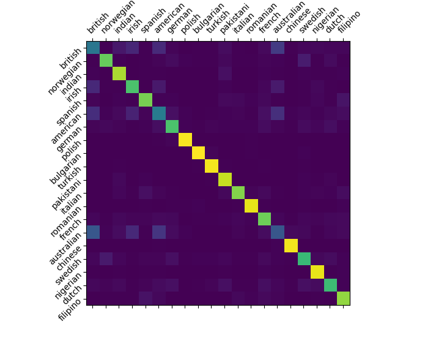
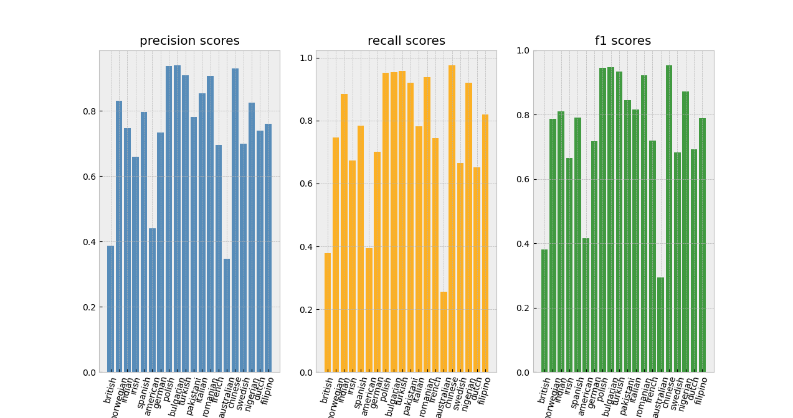

# This model classifies the 20 nationalities that occur in our dataset the most 

## | inputs:
 - must contain first and last name and can contain one or multiple middle names
 - only the 26 letters of the standard latin alphabet and spaces allowed

#

## | nationalities the model can classify:
```json
{
    "british": 0, "norwegian": 1, "indian": 2, "irish": 3, "spanish": 4,
    "american": 5, "german": 6, "polish": 7, "bulgarian": 8, "turkish": 9,
    "pakistani": 10, "italian": 11, "romanian": 12, "french": 13, "australian": 14,
    "chinese": 15, "swedish": 16, "nigerian": 17, "dutch": 18, "filipino": 19
}
```

#

## | performance and result metrics:
 - accuracy: 75.36%
 - confusion matrix: <br/> 
 - recall, precision and f1-scores: <br/> 

#

## | the model (stored in "src/final_model/"):
 - one 1d convolutional layer with input_features=200 and output_features=64 
 - followed by an LSTM with two internal layers
 - one final classification layer with log-softmax


