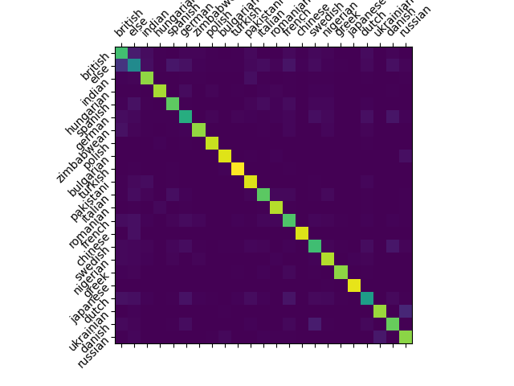
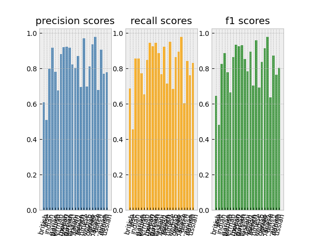

# This model classifies 21 nationalities and the "else" category

## | inputs:
 - must contain first and last name and can contain one or multiple middle names
 - only the 26 letters of the standard latin alphabet and spaces allowed

#

## | nationalities the model can classify:
```json
{
    "british": 0, "else": 1, "indian": 2, "hungarian": 3, 
    "spanish": 4, "german": 5, "zimbabwean": 6, "polish": 7, 
    "bulgarian": 8, "turkish": 9, "pakistani": 10, "italian": 11, 
    "romanian": 12, "french": 13, "chinese": 14, "swedish": 15, 
    "nigerian": 16, "greek": 17, "japanese": 18, "dutch": 19, 
    "ukrainian": 20, "danish": 21, "russian": 22
}
```

#

## | performance and result metrics:
 - accuracy: 81.08%
 - confusion matrix: <br/> 
 - recall, precision and f1-scores: <br/> 

#

## | the model (stored in "src/final_model/"):
 - one 1d convolutional layer with input_features=200 and output_features=64 
 - followed by an LSTM with two internal layers
 - one final classification layer with log-softmax


