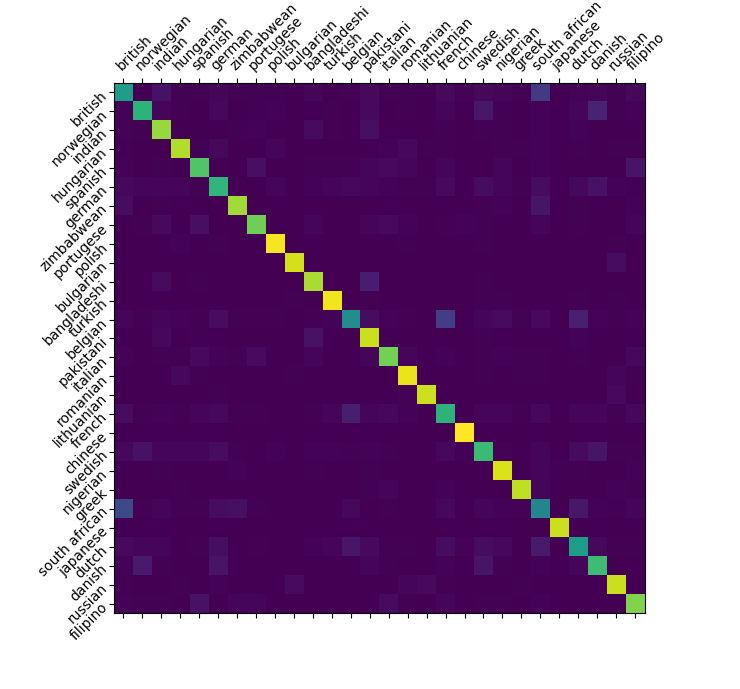
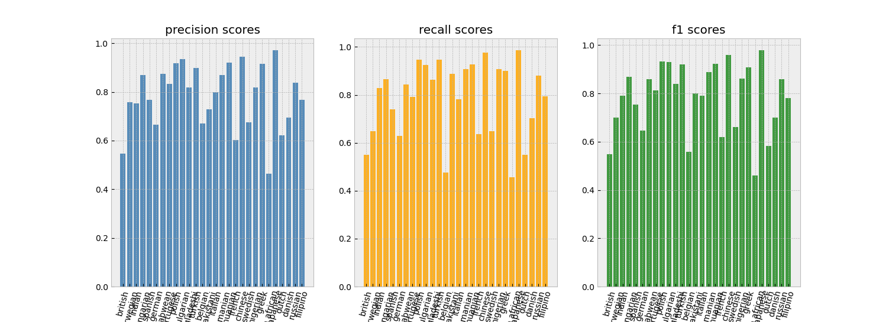

# This model classifies 28 nationalities of which only one is english speaking

## | inputs:
 - must contain first and last name and can contain one or multiple middle names
 - only the 26 letters of the standard latin alphabet and spaces allowed

#

## | nationalities the model can classify:
```json
{
    "british": 0, "norwegian": 1, "indian": 2, "hungarian": 3,
    "spanish": 4, "german": 5, "zimbabwean": 6, "portugese": 7,
    "polish": 8, "bulgarian": 9, "bangladeshi": 10, "turkish": 11,
    "belgian": 12, "pakistani": 13, "italian": 14, "romanian": 15,
    "lithuanian": 16, "french": 17, "chinese": 18, "swedish": 19,
    "nigerian": 20, "greek": 21, "south african": 22, "japanese": 23,
    "dutch": 24, "danish": 25, "russian": 26, "filipino": 27
}
```

#

## | performance and result metrics:
 - accuracy: 78.54%
 - confusion matrix: <br/> 
 - recall, precision and f1-scores: <br/> 

#

## | the model (stored in "src/final_model/"):
 - one 1d convolutional layer with input_features=200 and output_features=64 
 - followed by an LSTM with two internal layers
 - one final classification layer with log-softmax


