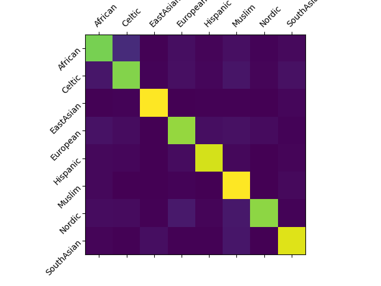
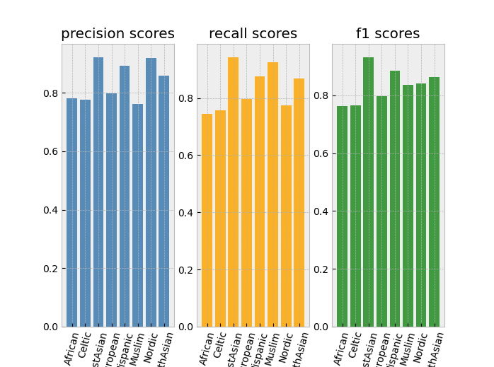

# this model classifies 8 major groups of nationalities

## | inputs:
 - must contain first and last name and can contain one or multiple middle names
 - only the 26 letters of the standard latin alphabet and spaces allowed

#

## | nationalities the model can classify:
```json
{ "African": 0, "Celtic": 1, "EastAsian": 2, "European": 3, "Hispanic": 4, "Muslim": 5, "Nordic": 6, "SouthAsian": 7 }
```

#

## | performance and result metrics:
 - accuracy: 83.55%
 - confusion matrix: <br/> 
 - recall, precision and f1-scores: <br/> 

#

## | the model (stored in "src/final_model/"):
Click [here](https://github.com/name-ethnicity-classifier/name-ethnicity-classification/blob/master/src/final_model/model.py) to see the model. 


